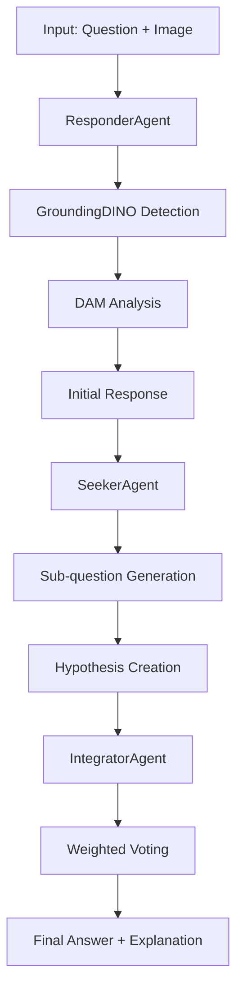

# FDR Framework Architecture

This document provides a detailed technical overview of the FDR (Seeker, Integrator, Responder) VQA framework architecture.

## 🏗️ System Overview

The FDR framework implements a **visualize-then-analyze** pipeline that combines object detection, image analysis, and multi-agent reasoning for enhanced Visual Question Answering.

### High-Level Flow


## 🤖 Agent Architecture

### 1. ResponderAgent

**Primary Responsibilities:**
- Visual object detection and localization
- Image analysis and description
- Question answering with visual context

**Enhanced Pipeline:**
```python
class ResponderAgent:
    def __init__(self, backend='vllm'):
        self.grounding_dino = GroundingDINO()
        self.dam_model = DAMModel()
        self.llm_client = vLLM_Client() or OpenAI_Client()
    
    def process(self, image_path, question):
        # 1. Extract detection keywords from question
        keywords = self._extract_keywords(question)
        
        # 2. Object detection with GroundingDINO
        detections = self.grounding_dino.detect(image_path, keywords)
        
        # 3. Create annotated image
        annotated_image = self._create_annotations(image_path, detections)
        
        # 4. DAM analysis of annotated image
        dam_analysis = self.dam_model.analyze(annotated_image, question)
        
        # 5. Generate response with visual context
        response = self.llm_client.generate(
            image=annotated_image,
            question=question,
            context=dam_analysis
        )
        
        return response
```

**Fallback Mechanisms:**
- If GroundingDINO fails → Use original image
- If DAM fails → Skip detailed analysis
- If vLLM fails → Fallback to OpenAI API

### 2. SeekerAgent

**Primary Responsibilities:**
- Generate relevant sub-questions
- Create logical hypotheses
- Assign confidence scores
- Build Multi-View Knowledge Base (MVKB)

**Core Algorithm:**
```python
class SeekerAgent:
    def process(self, initial_response, answer_candidates):
        # 1. Generate sub-questions to distinguish candidates
        sub_questions = self._generate_relevant_issues(
            initial_response, answer_candidates
        )
        
        # 2. Get answers for each sub-question
        sub_answers = []
        for question in sub_questions:
            answer = self.responder.process(image, question)
            sub_answers.append(answer)
        
        # 3. Create hypotheses from sub-question answers
        hypotheses = self._create_hypotheses(sub_answers, answer_candidates)
        
        # 4. Assign confidence scores
        confidence_scores = self._assign_confidence(hypotheses)
        
        # 5. Build MVKB
        mvkb = self._build_mvkb(
            sub_questions, sub_answers, hypotheses, confidence_scores
        )
        
        return mvkb
```

### 3. IntegratorAgent

**Primary Responsibilities:**
- Weighted voting mechanism
- Result aggregation
- Final decision making

**Voting Algorithm:**
```python
class IntegratorAgent:
    def integrate(self, mvkb, answer_candidates):
        votes = {}
        
        # For each hypothesis in MVKB
        for hypothesis in mvkb['hypotheses']:
            # Ask responder to vote given this hypothesis
            vote = self.responder.vote_with_context(
                original_question, 
                hypothesis['content'], 
                answer_candidates
            )
            
            # Weight vote by hypothesis confidence
            weighted_vote = vote * hypothesis['confidence']
            
            # Accumulate votes
            for candidate in answer_candidates:
                votes[candidate] = votes.get(candidate, 0) + weighted_vote.get(candidate, 0)
        
        # Select candidate with highest weighted vote
        final_answer = max(votes, key=votes.get)
        return final_answer, votes
```

## 🎯 Visual Enhancement Pipeline

### GroundingDINO Integration

**Object Detection Flow:**
```python
def detect_objects(self, image_path, text_prompt):
    # 1. Load and preprocess image
    image = self._load_image(image_path)
    
    # 2. Create detection prompt
    prompt = self._create_detection_prompt(text_prompt)
    
    # 3. Run inference
    boxes, logits, phrases = self.model.predict_with_caption(
        image=image,
        caption=prompt,
        box_threshold=0.35,
        text_threshold=0.25
    )
    
    # 4. Post-process results
    detections = self._post_process(boxes, logits, phrases)
    
    return detections
```

**Keyword Extraction:**
```python
def extract_detection_keywords(self, question):
    # Extract nouns and objects that can be visually detected
    keywords = self.nlp_extractor.extract_visual_entities(question)
    
    # Add contextual terms
    contextual_keywords = self._add_context(keywords, question)
    
    # Filter and validate
    final_keywords = self._filter_keywords(contextual_keywords)
    
    return final_keywords
```

### DAM Model Integration

**Image Analysis Pipeline:**
```python
def analyze_image(self, image_path, question):
    # 1. Load image and create conversation
    image = self._load_image(image_path)
    conv = self.conv_templates[self.conv_mode].copy()
    
    # 2. Process image through vision encoder
    image_features = self.vision_encoder(image)
    
    # 3. Generate detailed description
    conv.append_message(conv.roles[0], f"<image>\n{question}")
    conv.append_message(conv.roles[1], None)
    
    # 4. Generate response
    prompt = conv.get_prompt()
    response = self.model.generate(
        image_features, 
        prompt,
        max_tokens=1000
    )
    
    return response
```

## 🔄 Backend Architecture

### Configuration Management

**Unified Config System:**
```python
class ConfigLoader:
    def load_config(self, config_path):
        with open(config_path, 'r') as f:
            config = yaml.safe_load(f)
        
        # Load vLLM configuration
        vllm_config = config.get('vllm', {})
        
        # Load dataset configuration  
        dataset_config = config.get('dataset_paths', {})
        
        # Load inference parameters
        inference_config = config.get('inference', {})
        
        return config
```

### vLLM Client Integration

**OpenAI-Compatible Interface:**
```python
class vLLMClient:
    def __init__(self, base_url, model, api_key):
        self.client = OpenAI(
            base_url=base_url,
            api_key=api_key
        )
        self.model = model
    
    def generate_response(self, messages, **kwargs):
        try:
            response = self.client.chat.completions.create(
                model=self.model,
                messages=messages,
                **kwargs
            )
            return response.choices[0].message.content
        except Exception as e:
            # Fallback mechanism
            return self._fallback_generate(messages, **kwargs)
```

### Backend Selection

**Dynamic Backend Switching:**
```python
def create_agent(backend_type, config):
    if backend_type == 'vllm':
        return create_vllm_agent(config['vllm'])
    elif backend_type == 'openai':
        return create_openai_agent(config['openai'])
    else:
        raise ValueError(f"Unsupported backend: {backend_type}")
```

## 🧠 Reasoning Architecture

### Multi-View Knowledge Base (MVKB)

**Data Structure:**
```python
mvkb = {
    "initial_response": {
        "caption": "Description of the image",
        "answer_candidates": ["option1", "option2", "option3"]
    },
    "relevant_issues": [
        {
            "question": "Sub-question 1",
            "answer": "Answer to sub-question 1",
            "relevance_score": 0.9
        },
        # ... more issues
    ],
    "hypotheses": [
        {
            "content": "IF condition THEN conclusion",
            "confidence": 0.85,
            "supporting_evidence": ["fact1", "fact2"],
            "related_issues": [0, 1]  # indices of supporting issues
        },
        # ... more hypotheses
    ],
    "metadata": {
        "question_id": 12345,
        "processing_time": 2.5,
        "model_versions": {...}
    }
}
```

### Explainability Trace

**Complete Reasoning Chain:**
```python
explainability_trace = {
    "visual_detection": {
        "detected_objects": ["car", "tree", "road"],
        "detection_confidence": [0.95, 0.87, 0.92],
        "bounding_boxes": [...],
        "annotated_image_path": "output/annotated_12345.png"
    },
    "dam_analysis": "Detailed textual analysis...",
    "multi_view_knowledge_base": mvkb,
    "voting_results": {
        "option1": 0.85,
        "option2": 0.12,
        "option3": 0.03
    },
    "reasoning_steps": [
        "Step 1: Detected car in image",
        "Step 2: Analyzed car color as red",
        "Step 3: Generated hypothesis about car color",
        "Step 4: Voted based on visual evidence"
    ],
    "confidence_breakdown": {
        "visual_confidence": 0.95,
        "reasoning_confidence": 0.88,
        "final_confidence": 0.91
    }
}
```

## 🔧 Error Handling & Resilience

### Graceful Degradation

**Component Failure Handling:**
```python
def robust_process(self, image_path, question):
    try:
        # Try enhanced pipeline
        return self._enhanced_process(image_path, question)
    except GroundingDINOError:
        logger.warning("GroundingDINO failed, using direct VLM")
        return self._direct_vlm_process(image_path, question)
    except DAMError:
        logger.warning("DAM failed, using simplified analysis")
        return self._simplified_process(image_path, question)
    except vLLMError:
        logger.warning("vLLM failed, falling back to OpenAI")
        return self._openai_fallback(image_path, question)
```

### Health Monitoring

**System Health Checks:**
```python
def health_check(self):
    status = {
        "grounding_dino": self._check_grounding_dino(),
        "dam_model": self._check_dam_model(),
        "vllm_server": self._check_vllm_server(),
        "overall": "healthy"
    }
    
    if any(s != "healthy" for s in status.values() if s != "overall"):
        status["overall"] = "degraded"
    
    return status
```

## 📊 Performance Considerations

### Memory Management
- **GroundingDINO**: ~2GB GPU memory
- **DAM Model**: ~4GB GPU memory  
- **vLLM Server**: ~8GB GPU memory (varies by model)
- **Total**: ~16GB GPU memory recommended

### Optimization Strategies
- **Batch Processing**: Process multiple questions simultaneously
- **Caching**: Cache model outputs for repeated questions
- **Lazy Loading**: Load models only when needed
- **Memory Pooling**: Reuse GPU memory across operations

### Scalability
- **Horizontal**: Multiple worker processes
- **Vertical**: Larger GPU memory for bigger models
- **Distributed**: Split components across multiple machines

This architecture provides a robust, scalable, and maintainable foundation for advanced Visual Question Answering with explainable AI capabilities. 