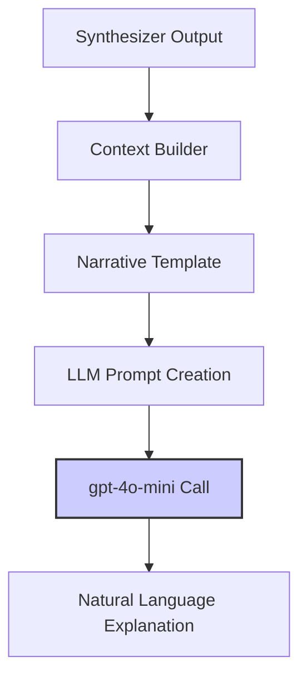

# THIẾT KẾ CHI TIẾT V2: SYNTHESIZER LOGIC ENGINE + ENHANCED EXPLANATION

## I. Tổng Quan và Nguyên Tắc Thiết Kế

Thiết kế V2 **GIỮ NGUYÊN** kiến trúc cốt lõi của `Synthesizer Logic Engine` và **TĂNG CƯỜNG** `Explanation Generator` để tạo ra lời giải thích mượt mà hơn, dễ so sánh với ground truth.

### Kiến Trúc Tổng Thể:
1.  **Synthesizer Logic Engine:** Giữ nguyên hoàn toàn - engine thuật toán deterministic, không sử dụng LLM.
2.  **Enhanced Explanation Generator:** Module riêng biệt, sử dụng LLM để chuyển đổi kết quả logic thành lời giải thích tự nhiên.

### Nguyên Tắc Cốt Lõi (Không thay đổi):
1.  **Tính Xác Định (Deterministic):** `Synthesizer` **KHÔNG** phải là một LLM. Với cùng một đầu vào, luôn tạo ra cùng một đầu ra.
2.  **Tính Có Thể Kiểm Chứng (Verifiable):** Toàn bộ logic của `Synthesizer` đủ đơn giản để con người có thể kiểm tra.
3.  **Tính Module Hóa (Modular):** `Synthesizer` chỉ thực hiện tổng hợp logic. `Explanation Generator` chỉ thực hiện tạo ngôn ngữ tự nhiên.
4.  **Tính Phi Trạng Thái (Stateless):** Mỗi lần chạy là một phép tính độc lập.

---

## II. Cải Tiến Dữ Liệu Đầu Vào

### Tăng Cường `hypothesis_set` từ Strategist

Để `Explanation Generator` có đủ ngữ cảnh, `Strategist` cần cung cấp thêm metadata:

```json
{
  "hypothesis_set": [
    {
      "hypothesis_id": "H_Red",
      "reasoning_description": "Nếu vật thể được xác định có màu đỏ, thì câu trả lời cuối cùng là màu đỏ",
      "IF": [
        { "evidence_id": "E03", "answer_is": "Red" }
      ],
      "THEN": { "final_answer": "Red" },
      "confidence_source": 0.95
    },
    {
      "hypothesis_id": "H_Blue", 
      "reasoning_description": "Nếu vật thể được xác định có màu xanh, thì câu trả lời cuối cùng là màu xanh",
      "IF": [
        { "evidence_id": "E03", "answer_is": "Blue" }
      ],
      "THEN": { "final_answer": "Blue" },
      "confidence_source": 0.90
    }
  ]
}
```

### Tăng Cường `evidence_set` với Mô Tả

```json
{
  "evidence_set": [
    {
      "evidence_id": "E01",
      "issue_text": "Locate the person on the left",
      "issue_description": "Xác định vị trí người đứng bên trái trong ảnh",
      "answer": "True",
      "confidence": 0.99
    },
    {
      "evidence_id": "E03",
      "issue_text": "Determine the color of that object",
      "issue_description": "Xác định màu sắc của vật thể mà người đó đang cầm",
      "answer": "Red", 
      "confidence": 0.96
    }
  ]
}
```

---

## III. Synthesizer Logic Engine (Không Thay Đổi)

### Đầu Ra của Synthesizer

`Synthesizer` vẫn trả về format gốc, nhưng `causal_trace` sẽ bao gồm metadata từ `hypothesis_set`:

```json
{
  "status": "CONCLUSIVE",
  "answer": "Red",
  "causal_trace": [
    {
      "hypothesis_id": "H_Red",
      "reasoning_description": "Nếu vật thể được xác định có màu đỏ, thì câu trả lời cuối cùng là màu đỏ",
      "triggered_by_evidence": [
        {
          "evidence_id": "E03",
          "issue_description": "Xác định màu sắc của vật thể mà người đó đang cầm",
          "answer": "Red"
        }
      ],
      "confidence_source": 0.95
    }
  ]
}
```

---

## IV. Enhanced Explanation Generator

### Kiến Trúc Explanation Generator



### Quy Trình 3 Bước

#### Bước 1: Context Builder
Trích xuất thông tin từ `causal_trace`:
- Hypothesis thắng cuộc và reasoning_description
- Evidence đã kích hoạt và mô tả của chúng  
- Mức độ tin cậy

#### Bước 2: Narrative Template
Tạo khung tường thuật cơ bản:
```
"Câu trả lời là '{answer}' dựa trên lý do: {reasoning_description}. 
Điều này được chứng minh bởi bằng chứng: {evidence_descriptions}."
```

#### Bước 3: LLM Enhancement
Prompt cho `gpt-4o-mini`:
```
Bạn là chuyên gia VQA. Hãy diễn đạt lại thông tin logic sau thành một lời giải thích tự nhiên, mạch lạc bằng tiếng Việt:

THÔNG TIN LOGIC:
- Câu trả lời: "Red"
- Lý do: "Nếu vật thể được xác định có màu đỏ, thì câu trả lời cuối cùng là màu đỏ"
- Bằng chứng: "Xác định màu sắc của vật thể mà người đó đang cầm → Red"

YÊU CẦU:
- Viết câu giải thích ngắn gọn, tự nhiên
- Tránh lặp lại cấu trúc logic máy móc
- Tập trung vào nội dung câu trả lời

Lời giải thích:
```

#### Kết Quả Mong Đợi:
"Vật thể mà người bên trái đang cầm có màu đỏ, được xác định thông qua việc phân tích màu sắc của vật thể trong ảnh."

---

## V. Ví Dụ Hoàn Chỉnh

### Input → Synthesizer → Explanation Generator

**1. Synthesizer Output:**
```json
{
  "status": "CONCLUSIVE",
  "answer": "Red", 
  "causal_trace": [...]
}
```

**2. Explanation Generator Input:**
```json
{
  "synthesizer_result": {...},
  "original_question": "What color is the object held by the person on the left?",
  "context": "VQA task about identifying object color"
}
```

**3. Final Output:**
```json
{
  "status": "CONCLUSIVE",
  "answer": "Red",
  "explanation_text": "Vật thể mà người bên trái đang cầm có màu đỏ, được xác định thông qua việc phân tích màu sắc của vật thể trong ảnh.",
  "causal_trace": [...]
}
```

---

## VI. Lợi Ích Của Thiết Kế V2

1. **Giữ nguyên tính Deterministic:** Synthesizer vẫn 100% có thể kiểm chứng
2. **Lời giải thích tự nhiên:** Dễ so sánh ngữ nghĩa với ground truth
3. **Tách bạch rõ ràng:** Logic reasoning vs Language generation
4. **Có thể tối ưu độc lập:** Có thể cải thiện Explanation Generator mà không ảnh hưởng đến Synthesizer
5. **Tương thích ngược:** Không phá vỡ pipeline hiện tại

---

## VII. Implementation Notes

### Cập Nhật Cần Thiết:

1. **Strategist (`strategist.py`):**
   - Thêm `reasoning_description` vào mỗi hypothesis
   - Thêm `issue_description` vào mỗi relevant issue

2. **Synthesizer (`synthesizer.py`):**
   - Bổ sung metadata vào `causal_trace`
   - Giữ nguyên logic cốt lõi

3. **Explanation Generator (Module mới):**
   - Implement context builder
   - Integrate với `gpt-4o-mini`
   - Template management

4. **Pipeline Integration:**
   - Cập nhật `inference.py` để gọi Explanation Generator sau Synthesizer 