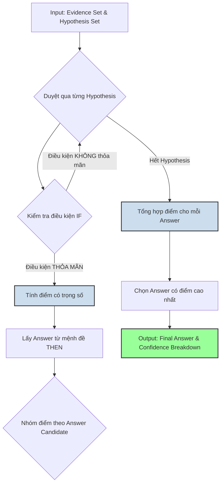

# THIẾT KẾ V3: WEIGHTED VOTING SYNTHESIZER ENGINE

## I. Tổng Quan và Mục Tiêu Thiết Kế

Thiết kế V3 là một bước tiến hóa quan trọng của `Synthesizer Engine`, thay thế lõi logic 3 tầng của V1/V2 bằng một cơ chế **bỏ phiếu theo trọng số (weighted voting)**. Mục tiêu là để tạo ra một hệ thống vừa **deterministic** vừa có khả năng lập luận **sâu sắc và linh hoạt**, giải quyết các hạn chế của các phiên bản trước.

### Mục Tiêu Chính:
1.  **Nâng Cao Tính Trung Thực (Faithfulness):** Thay vì chọn "người thắng cuộc đầu tiên" (winner-takes-all) như V1/V2, V3 sẽ tổng hợp **toàn bộ** bằng chứng và giả thuyết, giúp quyết định cuối cùng phản ánh đúng sức nặng của toàn bộ chuỗi lập luận.
2.  **Tăng Cường Khả Năng Lý Giải (Explainability):** Bằng cách tạo ra một `confidence_breakdown` chi tiết, V3 cung cấp nền tảng vững chắc cho `Explanation Generator` để tạo ra những lời giải thích sâu sắc, minh bạch và đáng tin cậy hơn.
3.  **Tận Dụng Triệt Để Confidence Score:** Mỗi điểm tin cậy, từ `Strategist` đến `Verifier`, đều đóng vai trò quan trọng trong việc định hình kết quả cuối cùng.

---

## II. Luồng Xử Lý và Thuật Toán Cốt Lõi

Kiến trúc V3 chuyển từ một chuỗi `if-then` cứng nhắc sang một quy trình bỏ phiếu dân chủ và có trọng số.

### Sơ Đồ Luồng Logic


### Thuật Toán Chi Tiết

```
1: procedure SYNTHESIZER_V3(EvidenceSet, HypothesisSet)
2:   VotingPool ← Khởi tạo map rỗng, ví dụ: {"Yes": 0.0, "No": 0.0}
3:   VotingTrace ← Khởi tạo map rỗng để lưu dấu vết
4:
5:   // Bước 1: Thu thập phiếu bầu từ tất cả các giả thuyết
6:   for H in HypothesisSet do
7:     is_triggered, relevant_evidences ← CheckConditions(H, EvidenceSet)
8:     if is_triggered then
9:       // Tính điểm có trọng số
10:      min_evidence_confidence ← min([E.confidence for E in relevant_evidences])
11:      weighted_score ← H.confidence_source * min_evidence_confidence
12:
13:      candidate_answer ← H.THEN.final_answer
14:
15:      // Bỏ phiếu và ghi lại dấu vết
16:      VotingPool[candidate_answer] += weighted_score
17:      VotingTrace[candidate_answer].append({
18:          "hypothesis_id": H.hypothesis_id,
19:          "weighted_score": weighted_score
20:      })
21:    end if
22:  end for
23:
24:  // Bước 2: Quyết định người chiến thắng và xử lý fallback
25:  if VotingPool is empty then
26:    // Fallback: Nếu không có giả thuyết nào được kích hoạt, chọn ứng viên đầu tiên
27:    final_answer ← FallbackMechanism(EvidenceSet)
28:    return "CONCLUSIVE_BY_FALLBACK", final_answer, {}
29:  end if
30:
31:  final_answer ← Answer có điểm cao nhất trong VotingPool
32:  final_confidence ← VotingPool[final_answer]
33:
34:  // Tạo Confidence Breakdown
35:  confidence_breakdown ← FormatVotingTrace(VotingTrace, VotingPool)
36:
37:  return "CONCLUSIVE", final_answer, final_confidence, confidence_breakdown
38: end procedure
```

---

## III. Cấu Trúc Dữ Liệu

### Đầu Vào (Inputs)
V3 kế thừa và tận dụng cấu trúc dữ liệu phong phú từ V2, bao gồm `reasoning_description` và `issue_description` để cung cấp ngữ cảnh đầy đủ.

### Đầu Ra (Output)
Đây là sự thay đổi lớn nhất. Cấu trúc đầu ra của V3 được thiết kế để tối đa hóa sự minh bạch.

```json
{
  "status": "CONCLUSIVE", // hoặc CONCLUSIVE_BY_FALLBACK
  "final_answer": "Red",
  "final_confidence": 1.60,
  "confidence_breakdown": {
    "Red": {
      "total_score": 1.60,
      "contributors": [
        { "hypothesis_id": "H_Red_Object", "weighted_score": 0.85 },
        { "hypothesis_id": "H_Is_Red", "weighted_score": 0.75 }
      ]
    },
    "Blue": {
      "total_score": 0.80,
      "contributors": [
        { "hypothesis_id": "H_Blue_Object", "weighted_score": 0.80 }
      ]
    }
  },
  "causal_trace": [...] // Vẫn có thể giữ lại để tương thích ngược nếu cần
}
```

---

## IV. Phân Tích Lợi Ích và Tác Động

### Lợi Ích So Với V1/V2
1.  **Lập Luận Toàn Diện:** Hệ thống không dừng lại ở giả thuyết hợp lệ đầu tiên mà xem xét tất cả các khả năng. Điều này đặc biệt quan trọng với các câu hỏi phức tạp trong bộ dữ liệu VQA-X, nơi có thể có nhiều luồng lập luận dẫn đến các câu trả lời khác nhau.
2.  **Tăng Cường Tính Trung Thực:** Quyết định cuối cùng dựa trên tổng sức nặng của bằng chứng, làm cho kết quả đáng tin cậy hơn. Một giả thuyết mạnh nhưng bị nhiều giả thuyết yếu hơn phản bác sẽ không dễ dàng chiến thắng.
3.  **Nền Tảng Vững Chắc cho Giải Thích:** `confidence_breakdown` là một mỏ vàng cho `Explanation Generator`. Nó có thể tạo ra các giải thích như:
    -   *"Câu trả lời là 'Yes' vì các bằng chứng ủng hộ nó (tổng điểm 1.6) mạnh hơn đáng kể so với các bằng chứng ủng hộ 'No' (tổng điểm 0.8)."*
    -   *"Mặc dù có một bằng chứng cho thấy vật thể có màu xanh, nhưng có tới hai luồng lập luận khác nhau cùng xác nhận rằng nó màu đỏ, do đó câu trả lời cuối cùng là 'Red'."*

### Tác Động Đến Pipeline
-   **`Synthesizer`:** Cần được viết lại hoàn toàn để implement thuật toán V3.
-   **`Explanation Generator`:** Cần được cập nhật để có thể đọc và tận dụng cấu trúc `confidence_breakdown` mới.
-   **`Strategist` và `Verifier`:** Không bị ảnh hưởng trực tiếp, nhưng chất lượng đầu ra của chúng (đặc biệt là `confidence score`) giờ đây sẽ có tác động lớn hơn đến kết quả cuối cùng.

---

## V. Kế Hoạch Triển Khai
1.  **Cập nhật `synthesizer.py`:** Implement class `SynthesizerV3` với logic "Weighted Voting".
2.  **Điều chỉnh `pipeline.py`:** Thay đổi lời gọi để sử dụng `SynthesizerV3`.
3.  **Nâng cấp `Explanation Generator`:** Thêm logic để đọc `confidence_breakdown` và tạo ra các lời giải thích có chiều sâu hơn.
4.  **Kiểm thử và Tinh chỉnh:** Chạy thử nghiệm trên bộ dữ liệu VQA-X/ViVQA-X để so sánh hiệu năng của V3 so với V1/V2 và tinh chỉnh các tham số nếu cần. 